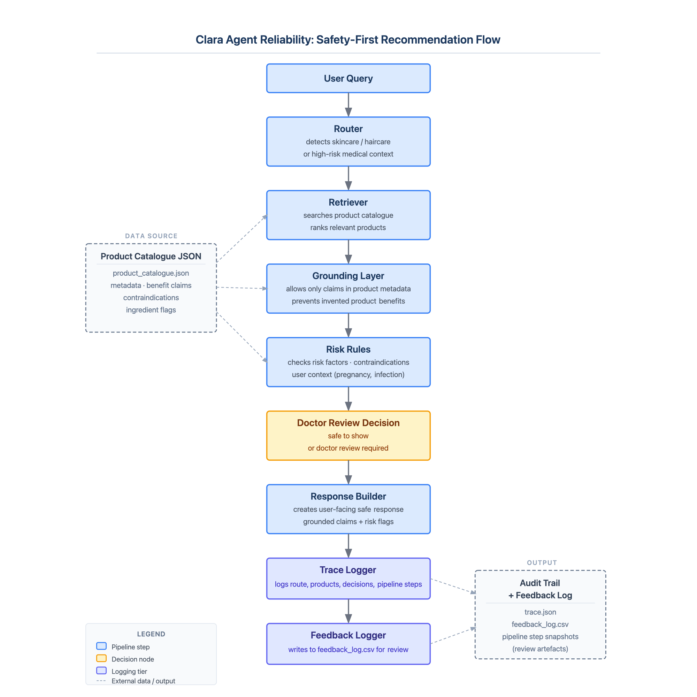

<div align="center">

# Clara Agent Reliability

**Safety gates for medical-adjacent recommendation agents**

*A demo pipeline showing routing, grounded claims, risk checks, doctor-review gating, trace logging, and feedback logging.*

<br>

[](#)
[](https://youtu.be/K3pfU-BcIXI)

<br>


</div>

---

## The Problem

In healthcare-adjacent domains, optimizing solely for **relevance** is risky. Standard language models and recommendation agents can match search terms to product descriptions, but they often ignore underlying medical safety constraints.

For example, a query for **"pregnancy + hair fall"** should not return a direct product recommendation if the retrieved product has contraindications for pregnant users. Instead, it must trigger a safety review.

This project implements a control layer that intercepts, evaluates, and gates agent responses before they ever reach the user.

---

## Architecture Pipeline

The system uses a sequential pipeline with built-in safety gates.

<p align="center">
  
</p>

---

## Demo

Run the demo locally to see the pipeline in action:

```bash
python demo.py
```

[Watch the demo video here](https://youtu.be/K3pfU-BcIXI)

### Example Output

```text
USER QUERY: I am pregnant and facing hair fall

ROUTE:
{'route': 'doctor_review', 'reason': 'Query contains high-risk medical context'}

USER RESPONSE:
Clinikally Hair ReGrow Serum may match your concern, but doctor review is required before use.

Doctor review reasons:
- Product is marked as requiring doctor review
- User query contains high-risk term: pregnant
- Product contraindication matches user's pregnancy/nursing context
```

---

## What It Demonstrates

This demo showcases several key reliability mechanisms:

- **Query Routing:** Early detection of high-risk medical context.
- **Product Retrieval:** Fetching based on allowed criteria.
- **Grounded Claims:** Ensuring the system does not hallucinate product benefits.
- **Risk Detection:** Checking product contraindications against user context.
- **Doctor-Review Decision:** Automatically halting the flow if a safety threshold is breached.
- **Trace Logging:** Full observability of the decision-making steps.
- **Feedback Logging:** Storing outcomes for continuous evaluation.

---

## Limitations

This is a focused reliability demo and is **not** a production healthcare system.

- Manual catalogue only
- Rule-based retrieval
- No embeddings yet
- No live product database
- No real doctor integration
- **Not for real medical use**

---

## Future Work

- [ ] Semantic retrieval
- [ ] Larger product catalogue
- [ ] Evaluation dataset
- [ ] Review dashboard
- [ ] Better safety test cases

<div align="center">
  <br>
  <sub>Built for testing reliability, safety, and traceability in medical-adjacent recommendation agents.</sub>
</div>
